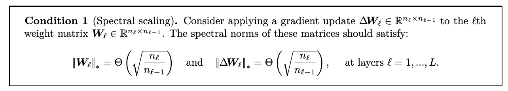

# Maximal update parametrisation learning rate scaling rules for ADAM
**Chris Wendler,**
**11/21/24**

This material is evolving. If you have questions or suggestions feel free to reach out to [me](https://wendlerc.github.io/). More [here](https://www.notion.so/Deep-learning-study-group-zero-shot-hyperparameter-transfer-3a0c41098d194238a380de9cd20cd735).

# Recap

Let’s start by recapitulating the ADAM update $\Delta W$and the spectral condition that we are trying to achieve. 

## Spectral condition

From the [spectral condition for feature learning paper](https://arxiv.org/abs/2310.17813) we know that in order to achieve feature learning our weight updates $\Delta W$ have to satisfy Condition 1:

## ADAM step ($$\Delta W$$)

From the ADAM paper:

$$
\text{(their } \theta \text{ is our } W\text{)}
$$

Thus, we have 

$$
\Delta W = \alpha \cdot \widehat{m}_t/(\sqrt{\widehat{v}_t}+\epsilon).
$$

# Derivation of the learning rate scaling factor

## Ansatz

1. In order to make the analysis of the order ($$\Theta$$ notation) of the spectral norm of $$\Delta W$$ easier, we are going to consider the limit of t going towards infinity. 
2. We are going to show that the resulting $$\Delta W$$ has entries of order $$\Theta(1)$$, which makes it easy to compute the order of $$\Delta W$$’s Frobenius norm.
3. By applying Lemma 1 (from Appendix B from the [spectral condition for feature learning paper](https://arxiv.org/abs/2310.17813)) we obtain (as width goes to infinity) that the order of $$\Delta W$$’s Frobenius norm and the order of its spectral norm are equal. Lemma 1:

**Intuition: $$\|\Delta W\|_2^2 = tr(\Delta W \Delta W^T) = \sum_i \sigma_i^2$$** (follows from trace rules). Thus, $$\frac{\|\Delta W\|_2^2}{\|\Delta W\|_*^2} = 1 + \underbrace{\sum_{k=2}^n \frac{\sigma_k^2}{\sigma_1^2}}_{\Theta(1)\text{ for }n\to\infty}$$.

Importantly, once we have the order of the spectral norm of $$\Delta W$$, we can simply set the learning rate such that Condition 1 is satisfied.

## Taking the limit in the number of steps

Recall

$$
\begin{aligned}
& m_t = \beta_1 m_{t-1} + (1 - \beta_1) g_t \\
& v_t = \beta_2 v_{t-1} + (1 - \beta_2) g_t^2 \\
&\widehat{m}_t = m_t / (1 - \beta_1^t)\\
&\widehat{v}_t = v_t / (1 - \beta_2^t)\\
&\Delta W = \alpha \cdot \widehat{m}_t/(\sqrt{\widehat{v}_t}+\epsilon).
\end{aligned}
$$

$$
\text{For }t\to\infty \text{ both } \widehat{m}_t \to m_t \text{ and } \widehat{v}_t \to v_t \text{ because } \beta_1, \beta_2 \in [0, 1).
$$

Therefore, we only need to consider $$m_t$$ and $$v_t$$. For taking the limit $$t \to \infty$$ it is easier to work with their closed form, which can be obtained via telescoping:

$$
\begin{aligned}
m_t &= \beta_1 (\beta_1 m_{t-2} + (1-\beta_1)g_{t-1}) + (1-\beta_1)g_t\\
&= \beta_1^2 m_{t-2} + \beta^1_1 (1 - \beta_1) g_{t-1} + \beta^0_1 (1 - \beta_1) g_t \\
&\dots \\
&= (1-\beta_1) \sum_{i=1}^t \beta_1^{t-i} g_i \\
\end{aligned}
$$

The same can be done for $$v_t$$, which results in

$$
\begin{aligned}
v_t &= (1-\beta_2) \sum_{i=1}^t \beta_2^{t-i} g_i^2.
\end{aligned}
$$

Both $$m_t$$ and $$v_t$$ are geometric series of i.i.d. random variables. 

### Lemma 2. The limit of a geometric series of i.i.d. random variables

$$
\text{Let } X_1, \dots, X_n \text{ be i.i.d. with } \mathbb{E}[X_i] = \mu. \text{ Then, } \lim_{n \to \infty} \sum_{i = 1}^n \beta^i X_i = \mu/(1-\beta).
$$

**Proof**

In order to proof this we are going to insert an extra zero, which will simplify the analysis:

$$
\begin{aligned}
\sum_{i = 1}^n \beta^i X_i &= \sum_{i = 1}^n \beta^i (X_i - \mathbb{E}[X_i] + \mathbb{E}[X_i])\\
&= \sum_{i = 1}^n \beta^i (X_i - \mathbb{E}[X_i]) + \sum_{i = 1}^n \beta^{i}\mathbb{E}[X_i].
\end{aligned}
$$

The **second term** now becomes

$$
\begin{aligned}
\sum_{i = 1}^n \beta^{i}\mathbb{E}[X_i] &= \mu \frac{1 - \beta^{n+1}}{1 - \beta}.
\end{aligned}
$$

which in the limit is

$$
\lim_{n \to \infty} \mu \frac{1 - \beta^{n+1}}{1 - \beta} = \frac{\mu}{1- \beta}.
$$

The **first term** now is a sum of i.i.d. variables with zero mean,

$$
\text{i.e., }Y_i = \beta^i (X_i - \mathbb{E}[X_i]) \text{ with } \mathbb{E}[Y_i] = 0.
$$

Thus, by applying the [law of large numbers](https://en.wikipedia.org/wiki/Law_of_large_numbers) we obtain that the first term converges to zero (in probability). This concludes the proof

$$
\lim_{n \to \infty} \sum_{i = 1}^n \beta^i X_i = 0 + \mu/(1-\beta).
$$

### Back to Adam

Applying our Lemma 2 to $$m_t$$ and $$v_t$$ for $$t \to \infty$$ results in 

$$
\begin{aligned}
m &= \lim_{t \to \infty} m_t = \mathbb{E}[g],\\
v &= \lim_{t \to \infty} v_t = \mathbb{E}[g^2] = Var[g] + \mathbb{E}[g]^2,
\end{aligned}
\\
\text{and }\Delta W \text{ approaches }\alpha \frac{m}{\sqrt{v} + \epsilon}.
$$

Notice that while $m$ and $v$ are matrices all operations were always applied entry-wise.  

## Frobenius norm “trick”

Now, assuming that the entry-wise expectation and variance of the gradients are of constant order

$$
\mathbb{E}[g_{ij}] = \mu_{ij} = \Theta(1) \text{ and } 
Var[g_{ij}] = \sigma_{ij}^2 = \Theta(1),

$$

it is straightforward to compute the order of the Frobenius norm

$$
\|\Delta W\|_2 = \Theta(\sqrt{\alpha ^2 n_{\ell} n_{\ell-1}}).
$$

Thus, by Lemma 1 from above the spectral norm also is of the same order

$$
\|\Delta W\|_* = \Theta(\sqrt{\alpha ^2 n_{\ell} n_{\ell-1}}) = \Theta(\alpha \sqrt{n_{\ell} n_{\ell-1}}).
$$

**Note:** I am not sure how realistic this assumption is. I mainly needed it to get the matching lower bound for the Frobenius norm. The upper bound can be done also without this assumption by using Jensen’s inequality. I would be grateful about some input here.

## Spectral norms and scaling factors

### Hidden layers

Let’s consider the typical case in which $$n_{\ell} = n_{\ell - 1} = n$$. As a result, we have $$\Delta W = \Theta(\alpha n)$$, which is required to be $$\Theta(1)$$ by Condition 1. Therefore, $$\alpha$$ must be in $$\Theta(\frac{1}{n})$$.

### Input embedding

Let’s consider the typical case in which $$n_{\ell} = n$$ and $$n_{\ell - 1} = c$$ (some constant). As a result, we have $$\Delta W = \Theta(\alpha \sqrt{cn}) = \Theta(\alpha \sqrt{n})$$, which is required to be $$\Theta(\sqrt{n})$$ by Condition 1. Therefore, $$\alpha$$ must be in $$\Theta(1)$$.

### Output embedding

Let’s consider the typical case in which $$n_{\ell} = c$$  and $$n_{\ell - 1} = n$$. As a result, we have $$\Delta W = \Theta(\alpha \sqrt{cn}) = \Theta(\alpha \sqrt{n})$$, which is required to be $$\Theta(\frac{1}{\sqrt{n}})$$ by Condition 1. Therefore, $$\alpha$$ must be in $$\Theta(\frac{1}{n})$$.

### Sanity check

Comparing our results to Table 3 from [tensor programs V](https://arxiv.org/abs/2203.03466) (in which fan_in = n) looks like we derived the same results:

# Acknowledgements

I want to thank Ilia Badanin and Eugene Golikov for helping me with this proof.