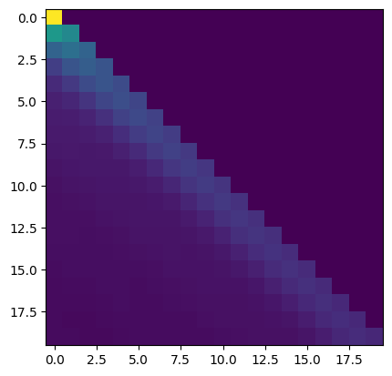
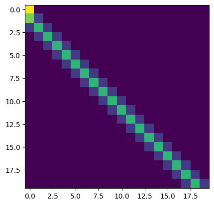
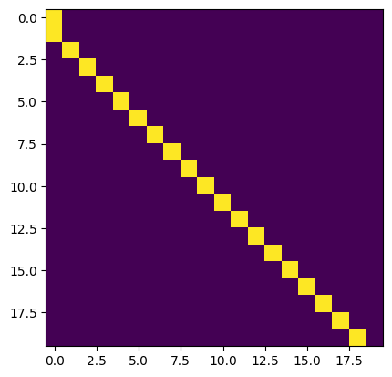

# Notes on rotary positional embeddings (RoPE)
**Chris Wendler,**
**08/19/25,**
**last updated: 08/29/25**

If you find mistakes or typos please reach out to me.

## Summary

Let $$D$$ be the dimension of the residual stream and $$d < D$$ the dimension of an attention head.

Let 
$$
R^{d}_{\Theta, m} = 
\begin{pmatrix}
\cos{m\theta_1} & -\sin{m\theta_1} & 0 & 0 & \cdots & 0 & 0 \\
\sin{m\theta_1} & \cos{m\theta_1} & 0 & 0 & \cdots & 0 & 0 \\
0 & 0 & \cos{m\theta_2} & -\sin{m\theta_2} & \cdots & 0 & 0 \\
0 & 0 & \sin{m\theta_2} & \cos{m\theta_2} & \cdots & 0 & 0 \\
0 & 0 & 0 & 0 & \cdots & \cos{m\theta_{d/2}} & -\sin{m\theta_{d/2}} \\
0 & 0 & 0 & 0 & \cdots & \sin{m\theta_{d/2}} & \cos{m\theta_{d/2}} \\
\end{pmatrix}.
$$

Then, we update keys using $$k_n = R^{d}_{\Theta, n} W_k x_n$$ 
and queries using $$q_m = R^{d}_{\Theta, m} W_q x_m$$.

Their dot product simplifies to (due to composition of rotation matrices)
$$
q_m^T k_n = x_m^T W_q^T R^{d}_{\Theta, n - m} W_k x_n.
$$

For more details, check out the [RoPE paper](https://arxiv.org/abs/2104.09864).

## Position-only attention heads

Given positional information only enters via RoPE, how can an attention head be achieved that solely relies on positional information?

### Previous token heads

Let's try to implement a simple previous token head using RoPE. This head should attend mostly to the previous token. E.g., $$q_{n+1}$$ should mostly match with $$k_n$$ and so on.

Their dot product simplifies to 
$$
q_{n+1}^T k_n = x_{n+1}^T W_q^T R^{d}_{\Theta, -1} W_k x_n.
$$

Without assumptions I don't see a straightforward way to achieve this previous token head. However, after discussing with my friend Jakob Heiss, we had the idea that we could assume that the model either has a bias term (one of the components of $$x_i \in \mathbb{R}^D$$ is a constant value) either because that bias term is hardcoded or because the previous layers have learned to create one. 

Thus, w.l.o.g. let's assume that for each $$i$$ we have $$x_{i1} = 1$$ (using 1-based indexing). Now, this can be used to create keys and queries that solely depend on the positional information.

Then, we could set $$W_k$$ such that, for all $$i$$, $$W_k x_{i} = (1, 0, 1, 0, \cdots, 1, 0)^T$$. That is, 
$$
W_{kij} := \begin{cases}
1 && \text{if } j = 1 \text{ and } i \text{ is odd,}\\
0 && \text{else.}
\end{cases}
$$

$$W_q$$ such that $$W_q x_{n+1}$$ matches $$R^{d}_{\Theta, -1} (1, 0, 1, 0, \cdots, 1, 0)^T = (\cos{\theta_1}, -\sin{\theta_1}, \cdots, \cos{\theta_{d/2}}, -\sin{\theta_{d/2}})$$ to maximize the dot product with $$k_{n}$$. Additionally, we can add a temperature parameter to control how sharp we want the attention head to be. Both can be achieved by setting $$W_q := \alpha R^{d}_{\Theta, -1} W_k,$$ in which $$\alpha > 0$$ is a temperature parameter. 

As a result, for $$q_{n+1}$$ we have that $$q_{n+1}^T k_n = (d/2)\alpha$$ and $$ q_{n+1}^T k_m = \alpha \sum_{\ell = 1}^{d/2} \cos{((m - n)\theta_{\ell})} < (d/2)\alpha $$, for $$m < n$$. Thus, for large $$\alpha$$ the softmax operation in the attention layer should mostly select the key at position $$n$$. Empirically (for sequence length 20, $$D = 768$$, $$d = 64$$) we have:

**Experiment 1 (previous token head by hand).**

$$\alpha = 1$$:

$$\alpha = 10$$:

$$\alpha = 100$$:

**Experiment 2 (finding purely positional heads).** If transformers converge to an implementation similar to the one presented here, which leverages this single constant dimension (and is equivalent to having a one-dimensional subspace spanned by $u$ with the property $$u^T x_i = c$$ with $$c \in \mathbb{R}$$, for all $$i$$), it should be possible to find purely positional heads by searching for heads with $$\mbox{rank}(W_Q) = \mbox{rank}(W_K) = 1$$. There may be other rank 1 heads as well, but the set of rank 1 heads should also contain all the purely positional ones that are implemented in this way.

## Semantic heads

Purely semantic heads, i.e., heads ignoring the positional information at first glance look challenging to implement with RoPE. This is because the pair-of-coordinate-wise rotations are applied to keys and queries right before computing the dot products. So strictly speaking it is not possible to fully get rid of the positional information. However, one can approximately get rid of it and minimize its effect of the positional information by only using the "last few" dimensions of the keys and queries for the semantic matching. The rationale behind this is to leverage the coordinates that are rotated the least (the last 2-components of the key and query vector are only rotated by an $$10^{-4}$$ rad).

Let's do a small example, in which we first don't address the positional encodings at all and then one in which we leverage only the last few coordinates.

#### RoPE introduces a recency bias

Let $$x_1 = x_2 = x_3 = \cdots = x_n = x$$ and let $$W_Q = W_K = (\mathbf{I}_{d} \mid \mathbf{0})$$, in which $$\mathbf{I}_d$$ is the $$d$$-dimensional identity matrix and $$\mathbf{0} \in \mathbb{R}^{d \times (D - d)}$$ a matrix of zeros. Let $$x'$$ denote the first $$d$$ components of $$x$$. The unnormalized attention scores become proportional to the cosine of the angle between $$x'$$ and $$R^{d}_{\Theta, n-m} x'$$: 
$$q_{m}^T k_n = x'^T R^{d}_{\Theta, n-m} x' = \|x'\|_2^2\cos(\angle(x', R^{d}_{\Theta, n-m} x')),$$ which is maximized for $$n = m$$ (i.e. for $$R^d_{\Theta, 0} = I$$).

$$x'^T R^{d}_{\Theta, n-m} x' = \|x'\|_2^2\cos(\angle(x', R^{d}_{\Theta, n-m} x')) = \sum_{i = 1}^{d/2} \underbrace{\cos((n-m)\theta_i)}_{\text{positional}}\underbrace{(x_{2i - 1}^2 + x_{2i}^2)}_{\text{semantic}}$$.

The relative contribution of the positional embeddings can be minimized by only leveraging the dimensions corresponding to small rotation angles: 

$$W_Q = W_K = (\mbox{diag}(0, \dots, 0, 1, 1) \mid \mathbf{0})$$, in which $$\mbox{diag}$$ is a diagonal matrix. In this case $$q_{m}^T k_n = \cos((n-m) \theta_{d/2}) (x_{d-1}^2 + x_d^2)$$, which for a typical choice of $$\theta_i = 10^{-4 \frac{2(i-1)}{d-2}}$$ is equal to $$\cos\left(\frac{n-m}{10^4}\right)(x_{d-1}^2 + x_d^2)$$. While this minimizes the effect of the rotations, it can be seen that there is still a small recency bias.

**RoPE bottleneck.** Thus, it seems like RoPE creates an even tighter bottleneck than the small dimensionality of the attention heads themselves $$d_{\text{semantic}} << d << D$$, in which $$d_{\text{semantic}}$$ denotes the number of dimensions that lend themselves the most for implementing semantic attention heads. 

**Experiment 3 (searching semantic heads).** It should be possible to search for semantic heads by searching for $$W_Q x_m, W_K x_n $$ that are bottom heavy or alternatively by looking for bottom heavy $$W_Q$$ and $$W_K$$.

**Experiment 4 (turning off RoPE).** Given that RoPE seems to create these complications for creating purely semantic heads, it might make sense to insert layers without RoPE or let attention heads learn whether or not to use RoPE.

**Question 1 (Does the RoPE bottleneck have downstream effects?)** If for semantic matching only a few dimensions are useful, how does that interact with the rest of the network? Considering a single semantic attention head, I wonder to which degree it is re-used. Are there semantic induction heads that are used for many different things? E.g., for matching countries and matching names and so on?

# Dealing with the attention head bottleneck

So far we only revised how to compute attention patterns. However, we also need to move information though the head. This is done by first downprojecting with $$W_V \in \mathbb{R}^{d \times D}$$ and then upprojecting using $$W_O \in \mathbb{R}^{D \times d}$$. All information that want's to flow through a head, has to go through $$W_O W_V$$ or in other words $$x_{\text{out}} = W_O W_V x$$. This raises several questions.

**Question 2 (Are there "single" heads that can approximately transport all tokens or is the vocabulary split across multiple heads?)** E.g., real previous token heads usually look exactly like the one we implemented by hand above (with $$\alpha = 100$$). This suggests that the head does not discriminate between different token identities. Similarly, transformers usually are capable to implement the famous induction pattern "A B ... A -> B" for all combinations of A and B (however, I think people rarely check whether individual induction heads "work" for all tokens). This raises the question how exactly transformers represent even basic things like token identities between 32000 (in Llama2) and >100.000 (in more recent models) tokens with in $$d$$ (= 128 in Llama2 (?)) dimensions. A naive baseline would be to, e.g., project onto the top-$$d$$ principal components of $W_E$. However, this approach would be lossy. Does superposition come to the rescue (again) or do model's always dedciate several $$W_O W_V$$'s for copying? Note that the notation here is confusing because I omitted head-indices.